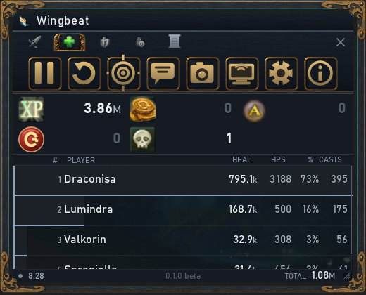
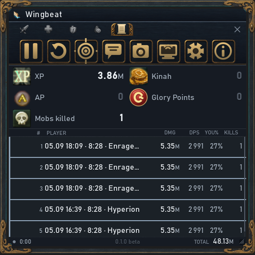
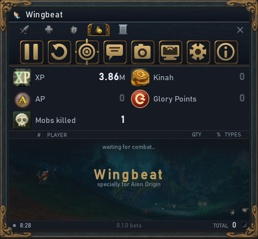
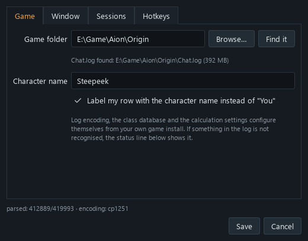
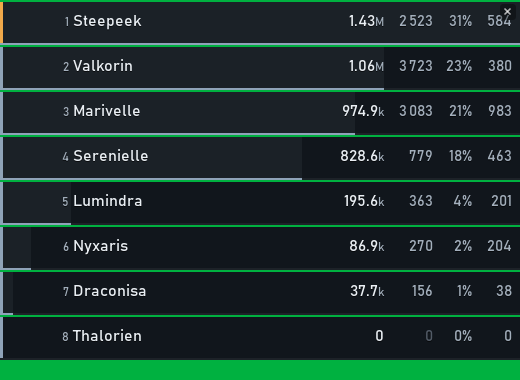
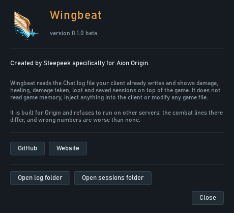

# Wingbeat

A damage meter for **Aion Origin**. It reads `Chat.log` — the file your client
already writes — and shows what actually happened in the fight: damage, DPS,
share, hits and crits, for you, your group and your pets.

It never touches the game. No memory reading, nothing injected, nothing written
into the game folder. One file opened for reading, and that is all.


---

## Which client

**Aion Origin only, English client only.**

The meter checks the client at startup and refuses to count on anything else
instead of quietly showing zeros. The reason is simple: combat lines are parsed
against a grammar taken from this exact client. On another version, or in
another language, those lines look different — and any numbers would be made up.

Other servers and languages can be added later. They are not supported now, and
pretending otherwise would only waste your evening.

---

## What it shows

**One list, no filters.** Everyone who dealt damage is in it. Your own row is
marked with an orange cap on the left and a bold name.

**A rail, not a filled bar.** The coloured strip is 3 px along the bottom edge
of the row, in your class colour, as long as your share of the leader. Text
never sits on a coloured background, so it stays readable over anything the game
draws underneath.

**A pace thread** runs inside that rail: its length is your *current* DPS
relative to the leader's. Longer than the rail means you are speeding up,
shorter means you are falling off. Details, Skada and Kagerou do not show this —
they only show what has accumulated.

**Click any row** to break it down: by skill on the damage and healing tabs, by
item on loot, by participant on sessions.

| | |
|---|---|
|  |  |
| **Healing** — the same layout, counted per caster. | **Sessions** — every past run, kept on disk. |

**Boss damage only** — a toggle in the window menu and in settings. The main
target is whichever one took the most damage; adds stop counting and the shares
are recalculated against the boss alone. The target's name shows in the footer,
so you can see what the meter thinks the boss is.

**Loot for the session** sits in the footer: XP, AP, kinah, mobs killed, PvP
kills, deaths. The loot tab shows who picked up what, with item names and
quality colours.



---

## What it cannot do — and never will

These are limits of the log itself, not of the program. There is no point
working around them.

- **No target HP**, so no boss health bar and no overkill accounting: the
  killing blow counts in full.
- **One-second resolution.** Current-DPS error is roughly 1/window — about 10%
  on a 10-second window. Comparing a peak DPS number against another meter
  without stating the window is meaningless; the figures will not match.
- **A group member cannot be told apart from a stranger** by a damage line —
  the text is identical for both. So the meter does not try: the list is shared.
- **Enemies cannot be spotted before they act.** The game does not log a hostile
  player appearing, and faction is not in the log at all. A puller and an ally
  look the same until one of them swings.
- **Only skill hits carry a skill name.** Auto-attacks have none in the log, so
  they are one line in the breakdown.
- **Only what the client sees.** Damage beyond draw distance never reaches the
  log, and shares are computed from what was seen.

---

## Install

You need Windows and chat logging enabled in the game.

**With the installer.** Download `WingbeatSetup-<version>.exe` from
[Releases](../../releases) and run it. It installs into your user profile — no
administrator rights needed. The wizard can add a desktop shortcut and start
Wingbeat with Windows.

**From the archive.** Download `Wingbeat-<version>.zip`, unpack it anywhere and
run `Wingbeat.exe`. Settings still live in `%APPDATA%\Wingbeat`, so the folder
itself can be moved around freely.

Windows will show a SmartScreen warning — the build is not signed with a
certificate. *More info* → *Run anyway*. The source is all here; you can read it
and build it yourself.

**From source.**

```
py -m pip install -r requirements.txt
py main.py
```

---

## First run

The meter looks for the game on its own. If it does not find it, settings open:
point **Game folder** at your client with *Browse*. The log file is found inside
it automatically, and the line underneath shows which one is being read and how
large it is.



**If the log does not exist yet**, the meter waits and starts counting the
moment the game creates it. Launching the meter before the game is the normal
order, especially with autostart.

**If it never appears**, your client is not writing a chat log. That is turned
on either in the server launcher (something like *Chat log*), or with
`g_chatlog = "1"` in `system.cfg`. Wingbeat will not write anything into the
game itself — that is your call to make, not the meter's.

---

## Controls

Drag the window by any part of it, resize it from the corner. Hovering a button
shows its name and a one-line explanation above it.

| Action | Default |
|---|---|
| Reset | Ctrl+Shift+F1 |
| Start / pause | Ctrl+Shift+F2 |
| Click-through on/off | Ctrl+Shift+F3 |
| Hide / show | Ctrl+Shift+F4 |
| Copy to clipboard | Ctrl+Shift+F5 |
| Streamer mode | Ctrl+Shift+F6 |

The tray icon mirrors the menu and is how you reach the meter when
click-through is on.

Hotkeys need a modifier, or the game swallows the key. If a combination is
already taken by another program, the meter says so at startup — `Ctrl+Shift+F1`
is often claimed by screen recorders.

The defaults sit on F-keys deliberately, not letters. On German, Polish and
French layouts AltGr is delivered as Ctrl+Alt, so a binding like Ctrl+Alt+C
would globally steal that letter from you in every program while the meter runs —
and registration still succeeds, so you would not even get a warning.

In a narrow window the layout degrades on its own: tab labels shorten first,
then columns drop from the right — crits, hits, share. The name column never
goes below 96 px, because a row reading `Ste…` is useless, while share and hits
are only reference figures.

---

## Streamer mode

The screen button, or Ctrl+Shift+F6. The window becomes bare damage rows on a
flat green background — no header, no buttons, no summary, no footer, no frame.
OBS keys that background out with a Chroma Key filter and only the rows remain.



Three ways out: the cross in the top right corner, the same hotkey, or the tray
menu.

The colour is `chroma_color` in settings, `#00B140` by default — the standard
green, not pure `#00FF00`. Pure green sits too close to the game's own interface
glow and eats the edges of letters when keyed. Click-through and transparency
are switched off while the mode is on: you cannot press the exit button through
a transparent window, and keying needs a solid background. Both come back as
they were when you leave.

---

## Sessions

A session is one run, the way a person means it: it starts with the first hit
and lives until you press Reset. Quitting closes it too — otherwise an evening
of farming would vanish whole.

Sessions are files in `%APPDATA%\Wingbeat\sessions`, one JSON each, named by
start time. There is deliberately no database here: a session is written twice
an evening, read in a batch when you open the tab, and a file can be opened,
sent to someone and deleted by hand. It is also the report itself, if the
numbers are disputed and you need to show what they were made of.

Inside: time and duration, the main target, kills, loot, and per participant —
damage, hits, crits, biggest hit, top skills and top targets. How many to keep
is a setting (200 by default, older ones are dropped). Saving can be turned off
entirely.

---

## How the numbers are worked out

| Value | Formula |
|---|---|
| **Damage** | every damage line for that player in the current count |
| **DPS** (column) | damage in the last `window` seconds ÷ `window`. 10 s by default. The final second of the file is skipped — it is still being written, and the number would jitter |
| **DPS** when nothing is happening | average: damage ÷ **active time** |
| **active time** | the sum of stretches separated by no more than the `activity gap` (8 s by default). Not wall-clock: standing idle does not count |
| **%** | share of the sum of all visible rows |
| **rail** | share of the **leader**, not of the total — first place is always full width |
| **pace thread** | your current DPS ÷ the leader's current DPS |
| **hits** | number of damage lines, periodic ticks included |
| **crit** | share of crits among all hits |
| **boss only** | damage and hits on the main target; both speed columns then show boss damage over active time, because the meter keeps no per-second breakdown per target |

The gap between "average" and "wall-clock" reaches 20× on the same data, which
is why active time is used — the Recount model, not the Skada one.

---

## Periodic damage

A damage-over-time tick looks like this in the log:

```
High Priest Esras received 745 damage due to the effect of Flame Cage V.
```

There is no author in that line, in any variant of the client's templates. But
there is one at the moment it was applied:

```
Loluu inflicted 1 234 damage on High Priest Esras by using Flame Cage V.
High Priest Esras is in the burning state because Loluu used Flame Cage V.
```

So the meter remembers who last applied a skill to that target and credits the
following ticks to them. **If two sorcerers overwrite each other's dots, the
damage goes to whoever applied last** — that is not a guess, it is the game's
own mechanic: the new dot replaces the old one and it is the last one ticking.

When there is nowhere to take the author from — some skills such as `Lava
Tsunami` tick with no direct-hit line at all — but the skill is in the class
database and exactly one player of that class is in the fight, it goes to them.
Otherwise it stays on a `(periodic)` row, together with godstone procs like
`Magical Water Damage Effect`, which have no owner in principle.

A tick on your own group is *incoming* damage and goes to the Damage Taken tab,
not into the group's output. Before that was separated, boss dots inflated the
group's damage by 1.57M out of 9.14M total dot damage on a real log.

---

## Where the class comes from

`Chat.log` has no class in it. But the skill's string name inside the client
encodes one: `STR_SKILL_RA_MovingShot_G1` is "Gale Arrow I", where `RA` is
Ranger. That table lives in `L10N/<language>/data/data.pak`, an ordinary ZIP
that opens without any keys.

On first run the meter builds a *skill → class* database from it and stores it
in `%APPDATA%\Wingbeat\skills.json`. It is not in this repository — it is client
data. It rebuilds itself when the client changes or the game folder moves.

On a real log: 4653 unambiguous skills, and the class of all 14 active players
resolved without a single conflicting vote. Players who only auto-attack get no
class — there is no skill name in the log to go on.

---

## Privacy

The meter reads your chat log, which is a position of trust, so it is worth
being exact about what it does.

**It reads** one file: `Chat.log` inside your game folder, opened for reading
only.

**It writes** only inside `%APPDATA%\Wingbeat` — settings, your sessions, the
skill and item databases built from your own client, and a log of its own
operation.

**It sends** nothing anywhere. The only network request it makes is an update
check against the GitHub releases API, and that can be switched off in settings.



Uploading fights to a ranking site is being built, and when it arrives it will
be **off by default**, will ask before the first upload, and will say exactly
what leaves your machine.

---

## If the meter shows zeros

1. **Is the game writing the log at all?** Open the game folder and look at the
   size of `Chat.log` — if it is not growing while you fight, chat logging is off.
2. **Is the right file being read?** Settings show the full path and size of the
   file in use.
3. **Is the meter paused?** The dot in the bottom left is grey when paused.
4. **Is the counter empty?** Reset clears it; the count starts again from the
   next hit.

The status line in settings shows how many lines were recognised out of how many
were read. If that ratio is far below 100%, the log is in an unexpected format —
open an issue and attach a few lines.

---

## Building

```
py build.py            # dist/Wingbeat — the program itself
py installer/make.py   # installer/out/WingbeatSetup-<version>.exe
```

The installer needs [Inno Setup 6](https://jrsoftware.org/isdl.php).

Note that `assets/` is not in this repository: icons and item names are
extracted from your own game client, and they belong to NCSoft. A build without
them runs, but shows no icons and no item names.

---

## License

MIT — see [LICENSE](LICENSE).

Aion and its images and names are the property of NCSoft. They are not in this
repository, and the MIT license does not extend to them.

Made by Steepeek for Aion Origin · [wingbeat.fun](https://wingbeat.fun)
