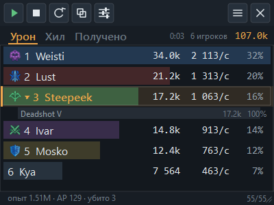
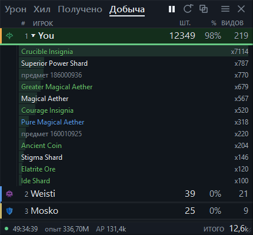

# AionMeter

Счётчик урона для Aion. Читает `Chat.log`, который клиент пишет сам, и показывает
таблицу поверх игры: урон, DPS, доля, удары, криты — по себе, группе и петам.

В игру не лезет: не читает её память, ничего в неё не внедряет и ничего не пишет
в папку игры. Открывает один файл на чтение — и всё.



## Что умеет

- **Старт, Стоп, Очистить** — кнопками на панели. Счёт копится, пока не
  нажать очистку, поэтому цифры не пропадают между боями.
- **Один список без фильтров.** Показываются все, кто наносил урон;
  своя строка помечена оранжевым капом слева и полужирным ником.
- **Рельс вместо заливки строки.** Полоса — 3 px по нижней кромке, цвета
  класса, длиной в долю от лидера. Текст при этом никогда не оказывается
  на цветном фоне и читается поверх любой картинки игры.
- **Нить темпа** — тонкая линия внутри рельса: длиной в текущий DPS
  относительно лидера. Длиннее рельса значит «разгоняется», короче —
  «сдулся». Такого нет ни у Details, ни у Skada, ни у Kagerou: они
  показывают только накопленное.
- **Высота окна по содержимому.** Растёт сразу, уменьшается только после
  трёх секунд тишины, потолок — та высота, которую растянули руками.
- **Разбор по скиллам.** Клик по строке раскрывает, чем именно бьёт игрок:
  каждый скилл с суммой и долей, автоатаки отдельно.
- **Добыча за сессию** строкой внизу: опыт, AP, кинара, убитые мобы,
  PvP-убийства, смерти.
- **Вкладка «Добыча»** рядом с уроном: кто из группы сколько предметов
  подобрал, а по клику — что именно, с названиями и цветом качества.
- **Периодический урон приписывается автору.** Тик дота в логе автора не
  содержит, но его можно взять с момента наложения — см. ниже.
- **Только урон по боссу.** Галочка в меню окна (три полоски справа) и в
  настройках. Главная цель боя — та, по которой набито больше всего урона;
  урон по аддам в таблицу не идёт, доли пересчитываются от неё же. Имя цели
  показывается в подвале, чтобы было видно, что именно метр считает боссом.
- **Вкладка «Сессии».** Сессия начинается с первого удара и закрывается
  кнопкой «Очистить» или выходом из программы. Закрытая ложится файлом в
  `%APPDATA%\AionMeter\sessions`; клик по строке показывает, кто в ней был
  и сколько набил.
- Пять вкладок: урон, хил, полученный урон, добыча, сессии
- Текущий DPS по скользящему окну и средний по активному времени
- Урон питомцев приписывается владельцу
- **Класс каждого игрока** определяется по использованным скиллам, строка
  красится в цвет класса
- Свой ник определяется сам (по строке про Glory Points при входе в игру)
  и показывается в таблице вместо «You»
- Копирование результата в буфер в виде, готовом для игрового чата:
  `Урон 2:14 | Steepeek 8.40M (1 825 dps) | Weisti 5.58M (1 800 dps)`,
  с разбивкой по лимиту строки
- Обычное непрозрачное окно; прозрачность и клик-сквозь включаются отдельно
- Глобальные хоткеи: работают, не переключаясь из игры

## Чего не умеет — и не сможет

Это ограничения самого лога, а не программы. Их нет смысла обходить.

- **Нет HP цели** и процента её здоровья. Значит нет полосы босса и нет учёта
  оверкилла: последний удар засчитывается целиком.
- **Точность времени — одна секунда.** Погрешность текущего DPS примерно 1/окно:
  на окне 10 с это около 10%. Пиковый DPS без указания окна сравнивать
  с чужими метрами бессмысленно — цифры не сойдутся.
- **Согруппника от постороннего по строке урона отличить нельзя** — текст
  у обоих одинаковый. Поэтому метр и не пытается: список общий.
- **Появление врага заранее не определить.** Игра не пишет в лог появление
  игрока чужой фракции, и фракции в логе нет вообще: «Puller» и союзник
  выглядят одинаково, пока не ударят. Видно только тех, кто уже вступил
  в бой в поле зрения.
- **Имя скилла есть только у скилловых ударов.** У автоатак его в логе нет
  вовсе, поэтому в разборе они идут одной строкой «автоатака».
- **Видно только то, что видит клиент.** Урон за пределами прорисовки в лог
  не попадает, и доля считается от увиденного.

## Как считается периодический урон

Тик дота в логе выглядит так:

```
High Priest Esras received 745 damage due to the effect of Flame Cage V.
```

Автора в этой строке нет — ни в одном варианте шаблона клиента. Зато он есть
в момент наложения:

```
Loluu inflicted 1 234 damage on High Priest Esras by using Flame Cage V.
High Priest Esras is in the burning state because Loluu used Flame Cage V.
```

Метр запоминает, кто последним применил скилл к этой цели, и приписывает
последующие тики ему. **Если два сорка перебивают доты друг друга, урон
уходит тому, кто наложил позже** — и это не догадка, а механика игры:
новый дот заменяет старый, тикает именно последний.

Если автора взять неоткуда (часть скиллов вроде `Lava Tsunami` тикает вообще
без строки прямого удара), но скилл есть в базе классов и в бою ровно один
игрок этого класса — урон уходит ему. Иначе остаётся строка
`(периодический)`: туда попадают проки с годстоунов вроде
`Magical Water Damage Effect`, у которых владельца нет в принципе.

Тик по своим — это входящий урон, он идёт во вкладку «Получено», а не в
общий урон. Раньше доты боссов по группе завышали наш урон: на реальном
логе это 1,57M из 9,14M всего урона дотов.

## Откуда берётся класс

В `Chat.log` класса нет. Но имя строки скилла в самом клиенте его кодирует:
`STR_SKILL_RA_MovingShot_G1` = «Gale Arrow I», где `RA` — рейнджер. Таблица
лежит в `L10N/<язык>/data/data.pak` — это обычный ZIP, читается без ключей.

При первом запуске метр собирает из него базу «скилл → класс» и кладёт в
`%APPDATA%\AionMeter\skills.json`. В репозиторий она не входит: это данные
клиента. Пересобирается сама, когда клиент сменился или папка игры стала другой.

На реальном логе: 4653 однозначных скилла, класс каждого из 14 активных
игроков определился без единого конфликтующего голоса. У тех, кто бьёт
только автоатаками, класса не будет — имени скилла в логе нет.

## Иконки и названия

Всё это лежит в папке `assets` рядом с программой — она приходит в архиве
релиза. Ставить и настраивать ничего не нужно.

| | |
|---|---|
| иконки скиллов | 1 440 файлов, покрывают **96,8 %** имён в логе и **99,3 %** событий |
| эмблемы классов | все 11 игровых классов |
| названия предметов | 104 374 записи, **98,0 %** номеров из живого лога |

Метр **в сеть не ходит вообще** и клиент игры в работе не трогает: читает
только `Chat.log`. Ассеты собираются один раз при подготовке релиза.

Свои картинки по-прежнему можно подложить, и они будут в приоритете:
`%APPDATA%\AionMeter\icons` для классов (`Ranger.png`, `RA.png`, `Sorc.png`
и так далее) и `%APPDATA%\AionMeter\skillicons` для скиллов, имя файла —
точное название скилла с рангом. Пути к этим папкам правятся ключами icons_dir и skill_icons_dir в config.json.

Без иконок метр работает: класс виден по цвету строки, предмет — по номеру.

### Откуда предмет — со склада или с моба

Клиент этого не пишет. И дроп, и взятое со склада, и вложение из письма
приходят одной и той же строкой `STR_MSG_GET_ITEM` — «You have acquired ...».
Слова «warehouse» в логе нет вовсе, а «Mail has arrived» — только уведомление
о письме, никак не связанное с моментом, когда вложение забирают. Покупки
различать не нужно: у них своя строка, «You have purchased».

Раз источник не написан, метр судит по обстановке: настоящий дроп падает во
время боя или сразу после него, а склад и почта — в городе. Окно после боя
25 секунд: труп обыскивают не мгновенно. На живом логе это отсеивает 8 %
подобранного — инсигнии, добавки, монеты, то есть ровно награды из почты.

Окно выбрано по колену кривой: при 10 с засчитывается 83 % добычи, при 25 с —
92 %, при 60 с — 94 %, дальше рост прекращается. Более строгий вариант (считать
только СВОЙ бой) отсеивал бы 20 %, но вместе с мусором выбрасывал руду, эфир и
стигма-шарды, добытые не своими руками. Отключается галочкой в настройках.

Качество предметов показывается цветом, как в игре: улучшенный зелёным,
героический синим, мифический золотым.



Картинки и названия — собственность NCSoft. В репозитории их нет, лицензия
MIT на них не распространяется.

## Установка

Нужен Windows и включённое ведение чат-лога в игре.

**Установщиком.** Скачайте `AionMeterSetup-<версия>.exe` из
[Releases](../../releases) и запустите. Ставится в профиль пользователя,
права администратора не нужны. В мастере можно сразу включить автозапуск
вместе с Windows и ярлык на рабочем столе.

**Архивом.** Если ставить не хочется — скачайте `AionMeter-<версия>.zip`,
распакуйте куда угодно и запустите `AionMeter.exe`. Настройки при этом всё
равно лягут в `%APPDATA%\AionMeter`, так что папку можно переносить.

Windows покажет предупреждение SmartScreen — сборка не подписана сертификатом.
«Подробнее» → «Выполнить в любом случае». Исходники здесь целиком, их можно
прочитать и собрать самому.

**Из исходников.**

```
py -m pip install -r requirements.txt
py main.py
```

## Первый запуск

При первом старте метр сам ищет игру. Если не нашёл — откроются настройки,
укажите **папку с игрой** кнопкой «Обзор». Файл лога метр найдёт в ней сам и
покажет строкой под полем, какой именно читает и какого он размера.

**Если файла ещё нет**, метр не сдаётся: он ждёт и начнёт считать сам, как
только игра создаст Chat.log. Порядок «сначала метр, потом игра» — обычный,
особенно когда метр стоит в автозапуске.

**Если файл не появляется вовсе**, значит клиент не ведёт чат-лог. Включается это по-разному:
в лаунчере сервера (пункт вроде Chat log / Console), либо параметром
`g_chatlog = "1"` в `system.cfg`. AionMeter сам ничего в игру не прописывает
намеренно — правку клиента лучше делать штатными средствами вашего сервера.

**Оверлей не виден?** Игра должна быть в оконном полноэкранном режиме
(borderless / windowed fullscreen). В эксклюзивном полноэкранном поверх игры
не рисуется ничего — это ограничение DirectX, а не программы.

## Управление

**Кнопки на панели** слева направо: Старт, Стоп, Очистить, Скопировать
в чат, Настройки. Справа — меню и выход. Наведите курсор: название кнопки
покажется в строке ниже.

**Вкладки** слева переключают, что считать: урон, хил, полученный урон или
добычу. Под ними — строка заголовков колонок.

В узком окне раскладка деградирует сама: сначала укорачиваются подписи
вкладок, потом отбрасываются колонки справа налево — крит, удары, доля.
Ник не ужимается ниже 96 px: строку, где от имени осталось «Ste…», читать
невозможно, а доля и удары — величины справочные.

**Клик по строке игрока** раскрывает разбор: по скиллам на вкладках урона и
хила, по предметам — на вкладке добычи, по участникам — на вкладке сессий.
Повторный клик сворачивает.

**Меню** — три полоски справа в шапке. Открывается сбоку от окна, а не
поверх таблицы: меню, закрывающее те самые строки, ради которых окно и
открыто, бесполезно. Если сбоку места на экране нет, уходит под окно.

| Действие | По умолчанию |
|---|---|
| Очистить | Ctrl+Shift+F1 |
| Старт / стоп | Ctrl+Shift+F2 |
| Клик насквозь вкл/выкл | Ctrl+Shift+F3 |
| Скрыть / показать | Ctrl+Shift+F4 |
| Скопировать в буфер | Ctrl+Shift+F5 |
| Режим стримера | Ctrl+Shift+F6 |

Иконка в трее дублирует меню и нужна, когда включён клик насквозь.
Окно перетаскивается за любое место, размер меняется за уголок.

Хоткею обязателен модификатор, иначе клавишу перехватит игра. Если сочетание
занято другой программой, метр скажет об этом при запуске — например,
`Ctrl+Shift+F1` часто занят программами записи экрана.

Умолчания намеренно на F-клавишах, а не на буквах. На немецкой, польской и
французской раскладках AltGr посылается системой как Ctrl+Alt, поэтому
сочетание вроде Ctrl+Alt+C глобально отбирает у человека ввод буквы во всех
программах, пока метр запущен, — и регистрация при этом проходит успешно,
так что и предупреждения он не увидит.

## Режим стримера

Кнопка с экраном в панели или Ctrl+Shift+F6. Окно превращается в чистые
полосы урона на однотонном зелёном фоне: ни шапки, ни кнопок, ни сводки, ни
подвала, ни рамки. Этот фон вырезается в OBS фильтром «Хромакей», и на
трансляции остаются только строки.

Выйти можно тремя способами: крестик в правом верхнем углу окна, то же
сочетание клавиш, пункт в меню значка в трее.

Цвет фона задаётся ключом `chroma_color` в настройках, по умолчанию
`#00B140` — стандартный зелёный, а не чистый `#00FF00`: последний слишком
близок к подсветке интерфейса игры и выедает края букв при кеинге. Клик
насквозь и прозрачность на время режима отключаются: сквозь прозрачное окно
не нажать кнопку выхода, а хромакею нужен сплошной фон. При выходе обе
настройки возвращаются как были.

## Сессии

Сессия — это один заход, каким его считает человек: она начинается с первого
удара и живёт, пока не нажата «Очистить». Выход из программы закрывает её
тоже — иначе вечерний фарм пропадал бы целиком.

Хранятся сессии файлами в `%APPDATA%\AionMeter\sessions`, по одному JSON на
сессию, имя — по времени начала. Базы данных здесь нет намеренно: пишется
сессия дважды за вечер, читается пачкой при открытии вкладки, а файл можно
открыть, переслать и удалить руками. Он же и есть готовый отчёт, если цифры
разошлись и надо показать, из чего они сложились.

Внутри: время и длительность, главная цель, убитые, добыча, и по каждому
участнику — урон, удары, криты, максимальный удар, топ скиллов и топ целей.
Сколько сессий держать, задаётся в настройках (по умолчанию 200, старые
удаляются сами). Сохранение можно выключить совсем.

## Как считаются цифры

| Величина | Формула |
|---|---|
| **Урон** | сумма всех строк урона игрока за текущий счёт |
| **DPS** (колонка) | сумма за последние `окно` секунд ÷ `окно`. По умолчанию 10 с. Последняя секунда файла не берётся: она ещё пишется, и число дёргалось бы |
| **DPS**, когда боя нет | средний: урон ÷ **активное время** |
| **активное время** | сумма отрезков, между которыми перерыв не больше `разрыва активности` (по умолчанию 8 с). Не календарное время боя: стоял без дела — время не идёт |
| **%** | доля от суммы всех видимых строк |
| **полоса** | доля от ЛИДЕРА, а не от суммы: у первого места она всегда во всю ширину |
| **нить темпа** | текущий DPS ÷ текущий DPS лидера |
| **удары** | число строк урона, включая тики дотов |
| **крит** | доля критов от всех ударов |
| **только босс** | урон и удары по главной цели; обе колонки скорости при этом показывают урон по боссу на активное время — посекундной раскладки по каждой цели метр не ведёт, и «текущий» DPS там взять неоткуда |

Разница между «средним» и «по календарю» доходит до 20 раз на одних и тех же
данных, поэтому метр считает по активному времени — это модель Recount, а не
Skada. Точность ограничена самим логом: время в нём с точностью до секунды,
поэтому погрешность окна около 1/окно, то есть примерно 10 % при окне 10 с.

## Настройки

Окно настроек открывается шестерёнкой на панели или из меню в трее. В нём
четыре вкладки и ровно то, что у разных людей действительно разное:

- **Игра** — папка с игрой и свой ник. Всё.
- **Окно** — поверх всех окон, прозрачный фон, клик насквозь, строка добычи
  внизу, непрозрачность.
- **Сессии** — сохранять ли их и сколько хранить.
- **Клавиши** — глобальные сочетания.

Полоса крупных кнопок и полоска опыта с кинарой в настройки не вынесены:
это часть окна, а не выбор. Выключаемая половина интерфейса — это две
программы вместо одной, и обе пришлось бы проверять.

Чего в окне нет намеренно. Кодировка лога определяется по содержимому.
База классов собирается из вашей же установки игры и пересобирается сама,
когда клиент сменился. Параметры расчёта — окно текущего DPS (10 с), конец
боя после тишины (12 с), разрыв активности (8 с) — зашиты: это не вкус, а
определения величин, и если они у всех разные, цифры несравнимы, а метр
нужен именно для сравнения.

Все настройки по-прежнему лежат в `%APPDATA%\AionMeter\config.json`, и
править их руками можно — просто это не то, что стоит совать каждому.

**Меню окна** — три полоски справа в шапке. Это переключатели на один вечер,
а не настройки: только урон по боссу, строка добычи внизу, клик насквозь,
прозрачный фон, поверх всех окон. Первой строкой в нём видно, сколько строк
лога распознано. Открывается меню сбоку от окна, чтобы не закрывать таблицу.

## Если метр показывает нули

Внизу окна настроек есть счётчик `разбор: N/M` — сколько строк распознано из
прочитанных. Нераспознанные складываются в `%APPDATA%\AionMeter\unknown.log`.

Строки чата туда не попадают: ни ваши реплики, ни шёпот, ни разговоры
согруппников. Этот файл прикладывают к сообщению о проблеме, и чужим
разговорам там не место. Размер ограничен мегабайтом, предыдущий файл
сохраняется рядом с суффиксом .prev.

Резкий рост нераспознанных означает, что сервер сменил тексты боевых сообщений
или у клиента другой язык. Регулярки рассчитаны на английский клиент.
Пришлите кусок `unknown.log` в Issues — добавлю шаблоны.

## Как это устроено

```
Chat.log ──► Tailer ──► parser ──► Meter ──► Overlay
 (игра)      ctypes     regex      окна,      PySide6
                                   бои
```

- [`aionmeter/tailer.py`](aionmeter/tailer.py) — чтение растущего файла.
  `FILE_SHARE_DELETE`, чтобы не мешать игре удалять лог; детект ротации по
  идентичности файла и подписи содержимого; незавершённая строка не отдаётся.
- [`aionmeter/parser.py`](aionmeter/parser.py) — грамматика боевых сообщений.
  Выведена из таблицы шаблонов самого клиента (`client_strings_msg.xml` внутри
  `data.pak`), а не подобрана на глаз.
- [`aionmeter/aggregate.py`](aionmeter/aggregate.py) — окна DPS, активное время,
  нарезка боёв, петы, мобы, добыча.
- [`aionmeter/overlay.py`](aionmeter/overlay.py) — окно, панель, таблица.

Самопроверка ядра, без графики и без интернета:

```
py tests.py
```

Консольный режим — удобно проверить, что цифры вообще считаются:

```
py console.py --once     разобрать весь лог и напечатать отчёт
py console.py            живая таблица в консоли
```

## Обновления

При запуске метр один раз спрашивает у GitHub, не вышла ли версия новее, и
если вышла — говорит об этом уведомлением. Ничего не скачивает и не подменяет
сам: тихо заменять exe у человека — плохая идея. Проверка выключается ключом check_updates в config.json, и тогда программа
не выходит в сеть вообще никогда.

Ручная проверка — в меню значка в трее.

## Если что-то пошло не так

Метр пишет свой лог в `%APPDATA%\AionMeter\aionmeter.log` — туда попадают
версия, найденный клиент, размер чат-лога, состав ассет-пака и полные
трейсбеки падений. Открыть папку можно из меню в трее. Этот файл — то, что
стоит приложить к сообщению о проблеме.

## Сборка

```
py -m pip install pyinstaller
py build.py                 # -> dist/AionMeter
py installer/make.py        # -> installer/out/AionMeterSetup-<версия>.exe
```

Для установщика нужен [Inno Setup 6](https://jrsoftware.org/isdl.php).

Программа собирается папкой, а не одним файлом, и без UPX: одиночный сжатый
exe от неизвестного издателя антивирусы любят класть в карантин.

Папка `assets` в репозиторий не входит и собирается отдельно из клиента игры.
Без неё сборка проходит, но выйдет без иконок и названий — `build.py` про это
предупреждает. Версия задаётся в одном месте, `aionmeter/version.py`, и оттуда
попадает и в программу, и в имя файла установщика, и в проверку обновлений.

## Лицензия

MIT.
